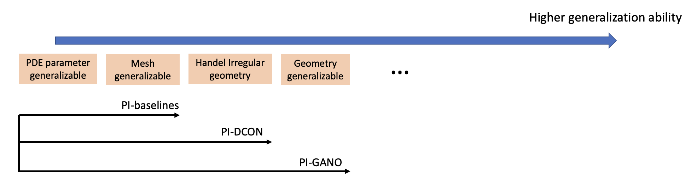
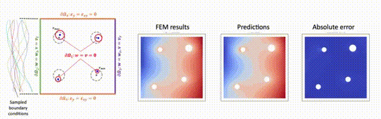

# Physics-informed Neural Foundation Operator

This Github repository will provide the latest updates on our works for developing **Physics-informed Neural Operators as Foundation Models**, which covers the methodology for developing neural operators that can generalize to any PDE problem settings (e.g. PDE parameters, domain geometries, initial and boundary conditions, time), without any FEM computation. The summary of our existing works are summarized as:



## PI-DCON

Physics-informed deep compositional operator network: This model can infer the solutions of partial differential equations (PDEs) with varying parameters in irregular geometries, purely trained in physics-informed manner wihtout any FEM computation. [[Arxiv link]](https://arxiv.org/html/2404.13646v1) [[paper link]](https://www.sciencedirect.com/science/article/abs/pii/S0045782524005309) [[Codes link]](https://github.com/WeihengZ/PI-DCON)


This work had been:
  - [x] accepted and presented in Engineering Mechanics Institute Conference (EMI)
  - [x] Accepted by Journal: Computer Methods in Applied Mechanics and Engineering

If you find our work beneficial for your research, please consider citing our paper in your manuscript:
```
@article{zhong2024physics,
  title={Physics-informed discretization-independent deep compositional operator network},
  author={Zhong, Weiheng and Meidani, Hadi},
  journal={Computer Methods in Applied Mechanics and Engineering},
  volume={431},
  pages={117274},
  year={2024},
  publisher={Elsevier}
}
```

## PI-GANO

Physics-informed Geometry-aware Neural Operator: This model can infer the solutions of partial differential equations (PDEs) with varying arbitary domain geometries, purely trained in physics-informed manner wihtout any FEM computation. [[Arxiv link]](https://arxiv.org/html/2408.01600v1) [[paper link]](https://www.sciencedirect.com/science/article/pii/S0045782524007941?via%3Dihub) [[Codes link]](https://github.com/WeihengZ/PI-GANO)

The codes of the paper will be released soon.



This work had been:
  - [x] accepted and presented in Engineering Mechanics Institute Conference (EMI)
  - [x] Accepted by Journal: Computer Methods in Applied Mechanics and Engineering

If you find our work beneficial for your research, please consider citing our paper in your manuscript:
```
@article{zhong2025physics,
  title={Physics-Informed Geometry-Aware Neural Operator},
  author={Zhong, Weiheng and Meidani, Hadi},
  journal={Computer Methods in Applied Mechanics and Engineering},
  volume={434},
  pages={117540},
  year={2025},
  publisher={Elsevier}
}
```

## PI-STGANO

Physics-informed Spatio-temporal Geometry-aware Neural Operator: An improved version of the PI-GANO designed for solving time-dependent PDE problems.

The manuscript and the codes of the paper will be released soon.

We would be happy to release the dataset before the paper submission in [[Google drive]](https://drive.google.com/drive/folders/1IItKM7k3kn5VWMupqqapefFX245kdBfZ?usp=sharing)

# Acknowledgements

I would also like to express my deep gratitude to my advisor, Prof. Hadi Meidani, for his invaluable guidance and support. Please feel free to explore more about our research group and our ongoing projects on [our group's website](https://uq.cee.illinois.edu/).


